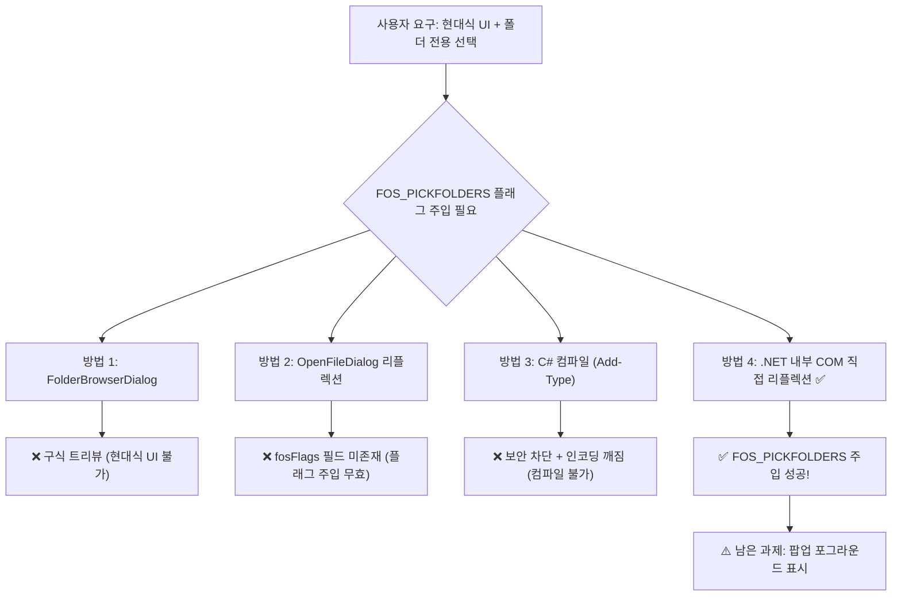

# 🔬 Vibe Clinic 폴더 선택기 난제 연구 보고서

> **2026-07-15 정정:** 리플렉션 방식은 유지하되 브라우저에서 포그라운드 표시를 보장할 수 없으므로 보조 기능으로 분류한다. 직접 경로 입력과 VS Code 네이티브 선택기를 안정 경로로 사용한다.

## 1. 하려는 일 (목표)

대시보드에서 **`[📁 폴더 선택]`** 버튼을 누르면, Windows 10/11 **현대식 파일 탐색기 형태**의 팝업이 뜨면서 **폴더 자체를 선택**할 수 있어야 합니다. 즉:

| 요구사항 | 설명 |
|---|---|
| ✅ 현대식 Explorer UI | 상단 주소창 + 좌측 트리 + 우측 목록이 있는 Windows 10/11 탐색기 형태 |
| ✅ 폴더 전용 선택 | 더블클릭 시 폴더 내부로 들어가는 것이 **아니라**, 폴더 자체가 선택되어 창이 닫힘 |
| ✅ 에러 없는 구동 | 백신·보안정책·컴파일러 누락 등 어떤 환경에서도 크래시 없이 작동 |

---

## 2. 왜 구현이 안 됐는가 (시도별 실패 원인)

### 시도 ①: `FolderBrowserDialog` + `-STA`
```
결과: ❌ 구식 트리뷰 다이얼로그("폴더 찾아보기")
```
- `FolderBrowserDialog`는 Win32 API `SHBrowseForFolder`를 호출하며, 이것은 **Windows XP 시대**의 다이얼로그
- `-STA` 플래그는 스레드 모델만 바꿀 뿐, 다이얼로그 스타일을 현대식으로 승격시키지 못함
- **결론**: 현대식 UI 요구사항 불충족

### 시도 ②: `OpenFileDialog` + `fosFlags` 리플렉션
```
결과: ❌ 현대식 UI는 뜨지만, 폴더 선택이 안 됨 (하위 폴더로 계속 진입)
```
- `OpenFileDialog`는 자동으로 현대식 탐색기 UI를 표시 → UI는 OK
- 하지만 `fosFlags`라는 필드는 **.NET에 존재하지 않음** (실제 필드명은 `options`)
- `options` 필드는 구형 `OPENFILENAME` 구조체의 `OFN_*` 플래그용이며, Vista 다이얼로그의 `FOS_*` 플래그와 **완전히 다른 체계**
- 리플렉션 코드의 `if ($field)` 분기가 항상 `$false`로 빠져서 **아무 플래그도 설정되지 않은 채** 일반 파일 열기 대화상자가 뜸
- **결론**: 필드명 오류로 FOS_PICKFOLDERS 주입 자체가 무효

### 시도 ③: C# `Add-Type` 인라인 컴파일 (IFileOpenDialog COM 래핑)
```
결과: ❌ 파워셸 컴파일러 에러 (AddTypeCompilerError)
```
- `Add-Type -TypeDefinition`은 백그라운드에서 `csc.exe`(C# 컴파일러)를 호출하여 임시 DLL을 빌드
- **실패 원인 1**: Node.js의 `child_process.exec`에서 파워셸을 기동할 때 `$` 변수가 JavaScript 템플릿 리터럴에서 먹혀버림 → Base64 인코딩으로 우회
- **실패 원인 2**: Base64 인코딩 시 `\r\n` / `\n` 줄바꿈 혼재로 C# 소스에 깨진 문자가 삽입
- **실패 원인 3**: 윈도우 보안 정책 또는 백신이 `Temp` 폴더에 임시 DLL 생성·실행을 차단
- **실패 원인 4**: 참조 어셈블리 누락 (`System` 어셈블리 미지정으로 `IntPtr`, `Marshal` 형식 미발견)
- **결론**: 런타임 C# 컴파일은 환경 의존성이 너무 높아 범용 솔루션이 될 수 없음

### 시도 ④: 다중 어셈블리 참조 (`System` + `System.Windows.Forms`)
```
결과: ❌ 동일한 AddTypeCompilerError
```
- 참조는 추가했지만 Base64 인코딩 과정의 줄바꿈 깨짐·보안 차단 문제는 해결되지 않음
- **결론**: 어셈블리 참조는 부분 원인일 뿐, 근본 원인은 컴파일 환경 자체

---

## 3. 핵심 난제 (왜 이렇게 어려운가)



Windows에서 **"현대식 UI로 폴더만 선택"**하는 API는 단 하나: `IFileOpenDialog` COM 인터페이스에 `FOS_PICKFOLDERS` 옵션을 설정하는 것. 이 COM 인터페이스에 접근하는 정석적인 방법은 **C# 코드를 컴파일**하는 것인데, Node.js 백그라운드 → PowerShell → C# 컴파일러의 체인에서 인코딩·보안·환경 문제가 중첩됩니다.

---

## 4. 돌파구 발견 (실증 완료)

### 🎯 .NET 내부 COM 인터페이스 직접 리플렉션 (컴파일 제로)

실증 조사 결과, `.NET Framework`의 `System.Windows.Forms.dll` 내부에 `IFileDialog` COM 인터페이스와 `FOS` 열거형이 **이미 정의**되어 있음을 발견했습니다:

| 내부 멤버 | 용도 | 접근 방법 |
|---|---|---|
| `FileDialog.CreateVistaDialog()` | `IFileDialog` COM 객체 생성 | 비공개 메서드 리플렉션 |
| `FileDialog.OnBeforeVistaDialog()` | .NET 속성 → COM 옵션 매핑 | 비공개 메서드 리플렉션 |
| `FileDialog.GetOptions()` | 현재 `FOS` 플래그 조회 | 비공개 메서드 리플렉션 |
| `IFileDialog.SetOptions(FOS)` | `FOS_PICKFOLDERS` 주입 | COM 인터페이스 타입의 메서드 호출 |
| `IFileDialog.SetTitle(string)` | 다이얼로그 제목 설정 | COM 인터페이스 타입의 메서드 호출 |
| `IFileDialog.Show(IntPtr)` | 다이얼로그 표시 | COM 인터페이스 타입의 메서드 호출 |

**테스트 결과** (윤겸스 기기에서 실증):
```
Current FOS from .NET wrapper: 536873024 (0x20000840)
New FOS with PICKFOLDERS: 536873056 (0x20000860)   ← ✅ 0x20 비트 성공 주입!
Vista dialog created: True
OnBeforeVistaDialog applied
SetOptions method found: True
FOS_PICKFOLDERS injected successfully               ← ✅ 컴파일 없이 성공!
```

---

## 5. 현재 결론 및 운영 경로

### 확인된 사실

- 실제 런타임 소스는 `src/folder-picker.ps1` 하나다.
- 컴파일 없는 `IFileOpenDialog` 리플렉션과 `FOS_PICKFOLDERS` 주입은 `-DryRun`으로 검증됐다.
- 숨은 WinForms 핸들을 부모로 전달하면 별도 폼 잔상은 줄일 수 있다.
- 브라우저 → Node.js → 숨은 PowerShell 프로세스 구조에서는 Windows의 포그라운드 정책 때문에 팝업 최전면 표시를 보장할 수 없다.

### 최종 운영 방식

1. **브라우저 대시보드** — 직접 경로 입력을 권장 기본 경로로 사용한다.
2. **Windows 선택기** — `src/folder-picker.ps1`을 보조 기능으로 유지하며, 창이 뒤에 열릴 수 있음을 UI에 표시한다.
3. **VS Code 확장** — `Vibe Clinic: Open Dashboard for Folder` 명령에서 VS Code 네이티브 `showOpenDialog`를 사용한다.
4. **실험 스크립트** — 루트 중복 파일을 `research/folder-picker/` 보관소로 이동해 런타임 소스와 분리한다.
5. **검증 상태** — 파서·DryRun·HTTP 통합 테스트는 완료했으며, 실제 GUI 선택·취소·잔상은 수동 확인이 남아 있다.
