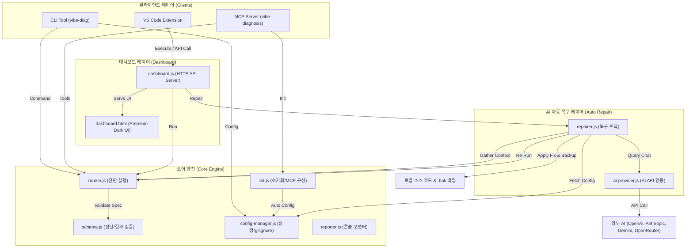

# 🩺 vibe-diagnosis 프로젝트 전수분석 보고서

이 보고서는 바이브코딩 프로젝트를 위한 자가 진단 프레임워크인 **vibe-diagnosis**의 아키텍처, 핵심 컴포넌트, 데이터 흐름, 그리고 구현 상세를 종합적으로 분석한 문서입니다.

---

## 1. 🏗️ 아키텍처 개요 및 데이터 흐름

`vibe-diagnosis`는 개발자(CLI, VS Code)와 AI 에이전트(MCP) 모두가 프로젝트의 건강 상태(Health)를 쉽게 측정하고, 오류가 발생했을 때 AI를 통해 코드를 자동 복구(BYOK - Bring Your Own Key)할 수 있도록 설계된 독립형 진단 프레임워크입니다.

### 📊 컴포넌트 간 관계 및 데이터 흐름 (Mermaid)

---

## 2. 📂 디렉토리 구조 및 핵심 컴포넌트 상세 분석

### 📁 `bin/` — CLI 진입점
- **[vibe-diag.js](file:///d:/D_Workspace_NB/-google-workspace/-antigravity-workspace/260709_vibe-diagnosis/bin/vibe-diag.js)**
  - 사용자 터미널에서 실행되는 `vibe-diag` 명령어의 라우팅을 담당합니다.
  - 제공 명령어: `init`, `run`, `dashboard`, `config` (get/set), `repair` (`--all` 또는 개별 `diagId` 복구).
  - 진단 에러(`ERROR` 상태)가 존재할 경우 프로세스 종료 코드(Process Exit Code)를 `1`로 반환하여 CI/CD 파이프라인과의 통합이 용이합니다.

---

### 📁 `src/` — 코어 엔진 및 비즈니스 로직
- **[runner.js](file:///d:/D_Workspace_NB/-google-workspace/-antigravity-workspace/260709_vibe-diagnosis/src/runner.js)**
  - `.vibe-diagnosis/diagnostics/` 디렉토리에 있는 `*.diag.js` 형식의 진단 스크립트를 탐색(Discover)하고 순차 실행합니다.
  - Node.js의 `require.cache`를 제거(`delete require.cache[...]`)한 후 진단 모듈을 동적으로 가져와 변경된 코드를 즉각 반영합니다.
  - 진단별 타임아웃 제한(`timeout` 필드, 기본값 30초)을 지원하여 무한 루프나 외부 API 지연으로 인해 전체 진단이 멈추는 것을 방지합니다 (`Promise.race` 구현).

- **[schema.js](file:///d:/D_Workspace_NB/-google-workspace/-antigravity-workspace/260709_vibe-diagnosis/src/schema.js)**
  - 진단 파일의 스펙(id, name, layer, run 함수 존재 여부)과 진단 실행 결과(OK, WARNING, ERROR 상태 등)를 엄격히 검증하는 린터 역할을 수행합니다.
  - 레이어 필드는 반드시 `TASK`, `FUNCTION`, `SYSTEM` 중 하나여야 합니다.

- **[init.js](file:///d:/D_Workspace_NB/-google-workspace/-antigravity-workspace/260709_vibe-diagnosis/src/init.js)**
  - 프로젝트 내에 `.vibe-diagnosis/` 폴더를 생성하고, 기본 템플릿 파일들(`config.json`, `example.diag.js`, `error-pattern.md`)을 복사합니다.
  - 또한 `.gemini/settings.json`이 존재하거나 생성 가능한 경우 `vibe-diagnosis` MCP 설정을 자동으로 삽입하여 AI 에이전트와의 협업을 즉시 세팅합니다.

- **[config-manager.js](file:///d:/D_Workspace_NB/-google-workspace/-antigravity-workspace/260709_vibe-diagnosis/src/config-manager.js)**
  - 설정 파일(`.vibe-diagnosis/config.json`)을 읽고 씁니다.
  - 보안을 위해 `BYOK`용 API 키 노출을 차단하는 마스킹(`maskKey`) 처리를 제공합니다.
  - 환경변수(`VIBE_DIAG_PROVIDER`, `VIBE_DIAG_API_KEY`, `VIBE_DIAG_MODEL`)를 최우선으로 적용(Override)할 수 있도록 구현되어 CI/CD 환경에서도 안전하게 작동합니다.
  - 보안 사고 방지를 위해 API 키가 저장되는 `config.json`을 프로젝트의 `.gitignore`에 자동으로 추가(`ensureGitignore`)합니다.

- **[reporter.js](file:///d:/D_Workspace_NB/-google-workspace/-antigravity-workspace/260709_vibe-diagnosis/src/reporter.js)**
  - CLI 실행 결과를 가독성 높은 ANSI 컬러 콘솔 화면으로 포맷팅하거나, 기계가 파싱할 수 있도록 구조화된 JSON 데이터로 출력합니다.
  - 전체 건강 점수(`Health %`)를 공식 `(OK 노드 수 / 전체 노드 수) * 100`에 따라 계산합니다.

- **[ai-provider.js](file:///d:/D_Workspace_NB/-google-workspace/-antigravity-workspace/260709_vibe-diagnosis/src/ai-provider.js)**
  - 다양한 인공지능 프로바이더(OpenAI, Anthropic, Google Gemini, OpenRouter)의 채팅 완성 API 규격을 공통 인터페이스(`chat`)로 추상화하여 연동합니다.
  - 종속성을 최소화하기 위해 외부 라이브러리(axios 등) 없이 Node.js 내장 `fetch` API를 직접 사용합니다.

- **[repairer.js](file:///d:/D_Workspace_NB/-google-workspace/-antigravity-workspace/260709_vibe-diagnosis/src/repairer.js)**
  - 진단 실패 시 해당 에러 로그, 원본 진단 소스 코드, 프로젝트 구조, `package.json`, 그리고 기록된 과거 에러 패턴(`.vibe-diagnosis/error-patterns/`)을 취합하여 AI 어시스턴트에게 상황을 설명하는 정밀 프롬프트를 구성합니다.
  - AI로부터 수정 대상 파일 목록과 소스 코드(전체 소스코드 치환 방식)를 JSON 형식으로 전달받아 로컬 파일에 반영합니다.
  - 반영 전 원본 코드를 백업하기 위해 파일명 뒤에 `.bak`을 붙여 복사본을 생성해 안전 장치를 마련합니다.
  - 파일 수정 이후 해당 진단을 즉시 재실행하여 문제가 완전히 해결되었는지(`status === 'OK'`) 여부를 판별합니다.

- **[dashboard.js](file:///d:/D_Workspace_NB/-google-workspace/-antigravity-workspace/260709_vibe-diagnosis/src/dashboard.js) & [dashboard.html](file:///d:/D_Workspace_NB/-google-workspace/-antigravity-workspace/260709_vibe-diagnosis/src/dashboard.html)**
  - 로컬 전용(`127.0.0.1`)으로 바인딩되는 초경량 웹 대시보드 서버를 띄웁니다.
  - `Inter` 폰트 기반의 고품격 다크 모드 UI와 글래스모피즘(Radial Glow) 그래픽, 건강 지표를 한눈에 보여주는 SVG 원형 링 게이지 등을 장착하여 매우 직관적이고 세련된 사용자 경험을 전달합니다.
  - 웹 화면에서 즉각적으로 "Run Diagnostics"와 ERROR 카드의 "Auto Repair" 기능을 제어할 수 있습니다.

---

### 📁 `mcp-server/` — Model Context Protocol 서버
- **[index.js](file:///d:/D_Workspace_NB/-google-workspace/-antigravity-workspace/260709_vibe-diagnosis/mcp-server/index.js)**
  - Model Context Protocol(MCP) 스펙을 구현하여, AI 코딩 어시스턴트가 프로젝트 자가진단 시스템을 도구(Tool)로 다룰 수 있게 해줍니다.
  - 제공 도구(6종):
    1. `run_diagnostics`: 전체 진단 테스트 구동 및 JSON 리포트 회신
    2. `init_diagnostics`: `.vibe-diagnosis/` 생성 및 기본 구조 초기화
    3. `list_diagnostics`: 발견된 모든 진단 목록 및 적합성 정보 수집
    4. `read_error_pattern`: 축적된 과거 에러 패턴 로그(Markdown) 조회
    5. `write_error_pattern`: 새로운 에러 패턴을 마크다운 문서로 로컬 저장소에 기록
    6. `open_dashboard`: 웹 브라우저 대시보드 서버를 비동기 자식 프로세스(`child_process.spawn`)로 백그라운드 기동

---

### 📁 `vscode-extension/` — VS Code 확장 기능
- **[extension.js](file:///d:/D_Workspace_NB/-google-workspace/-antigravity-workspace/260709_vibe-diagnosis/vscode-extension/src/extension.js)**
  - VS Code에서 `vibe-diagnosis` 기능을 바로 사용할 수 있도록 통합하는 클라이언트 코드입니다.
  - 상태 표시줄(Status Bar)에 현재 건강도 퍼센트를 하트 이콘과 함께 상시 표시하며, 상태가 나쁠 때는 경고 색상(`warningBackground` / `errorBackground`)으로 사용자 주의를 환기시킵니다.
  - 진단 에러가 검출되면 VS Code 내부의 `DiagnosticCollection`에 문제를 등록하여 소스 코드 편집기 내의 빨간 줄/노란 줄 표시와 "문제(Problems)" 패널에 실시간으로 바인딩합니다.
  - QuickPick 창을 띄워 실패한 진단 목록 중 하나를 선택해 즉시 AI 자동 복구(`autoRepair`) 명령을 내릴 수 있습니다.

---

### 📁 기타 구성요소
- **`templates/`**: 초기화 시 복제 대상이 되는 설정, 예제 진단 스크립트 및 에러 패턴 구조 파일들이 위치합니다.
- **`test/`**: 프레임워크 자체의 유효성을 검증하는 Node.js 자체 테스트 코드([unit.test.js](file:///d:/D_Workspace_NB/-google-workspace/-antigravity-workspace/260709_vibe-diagnosis/test/unit.test.js))가 들어있습니다. 외부 라이브러리 없이 순수 Node.js Assert를 이용해 동작합니다.

---

## 3. 💡 설계의 핵심 강점 및 디자인 패턴

1. **무의존성 코어(Zero-dependency Core) 설계**
   - 코어 모듈들과 유닛 테스트가 오직 Node.js 표준 라이브러리(`fs`, `path`, `http`, `child_process`, `assert` 등)만을 사용하여 구현되었습니다. 설치 용량이 극도로 가볍고, 다양한 Node.js 개발 환경에 손쉽게 녹아듭니다.
2. **AI 에이전트 친화적인 에코시스템**
   - MCP 서버와 `.agents/AGENTS.md` 연계를 통해 코딩 에이전트가 코드를 작성한 직후 `run_diagnostics`를 실행해 스스로 검증하도록 룰이 확립되어 있습니다.
   - 반복되는 장애 예방을 위한 `error-patterns` 문서화 기법을 사용하여 AI가 과거의 시행착오를 답습하지 않게 유도합니다.
3. **가역성 복구 시스템**
   - AI 수리를 실행할 때 항상 `.bak` 백업 파일을 먼저 만들어 두어 잘못된 AI 코드가 덮어쓰여도 터미널이나 대시보드 조작을 통해 이전 상태로 손쉽게 롤백할 수 있게 합니다.

---

## ⚠️ 4. 주의점 및 운영 팁

- **API 키 관리 (보안)**: `.vibe-diagnosis/config.json`에 `apiKey`가 플레인 텍스트로 저장되므로, 실수로라도 원격 레포지토리에 푸시되지 않도록 프로젝트 초기화 시 자동으로 작동하는 `.gitignore` 자동 삽입 메커니즘을 훼손해서는 안 됩니다.
- **AI 토큰 비용 및 전체 파일 치환**: `repairer.js`는 패치(diff) 방식이 아니라 수리할 파일의 전체 내용(Complete content)을 AI로부터 응답받아 통째로 교체합니다. 파일의 크기가 과도하게 클 경우 API 요금 증가와 입력 제한에 걸릴 위험이 있으므로, 각 소스 코드는 단일 책임 원칙에 따라 분할 보관하는 것을 추천합니다.
